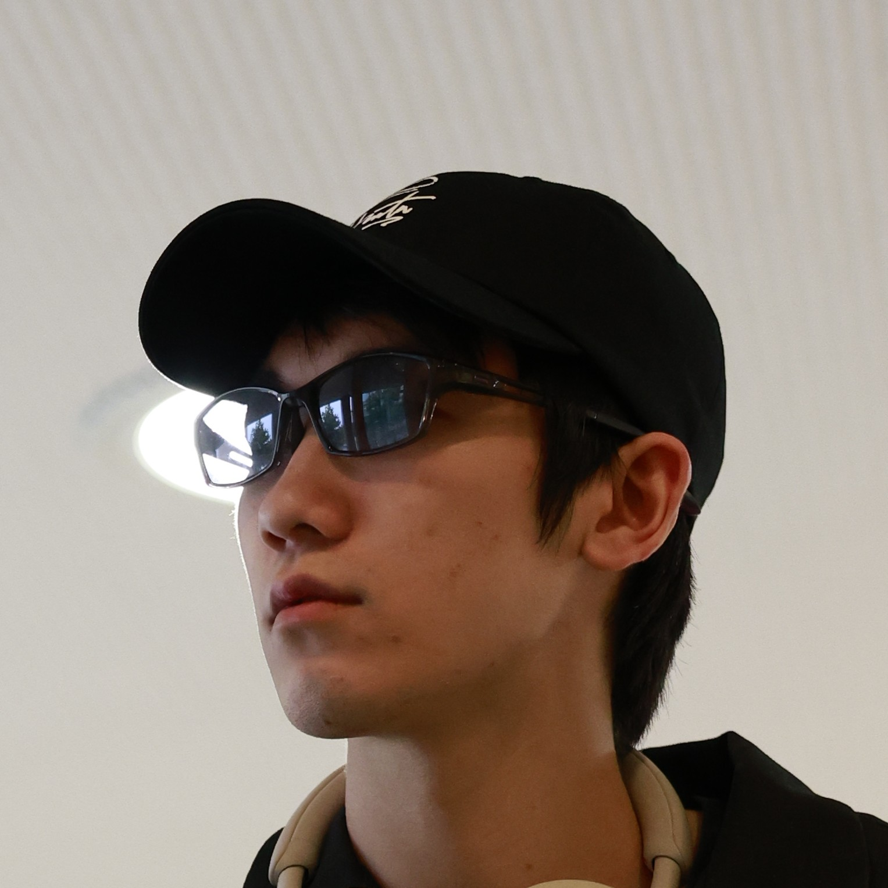

# About me

<pre><code>
[
  "name_jp" : "北川幸輝",
  "name_en" : "Kouki KITAGAWA",
  "attribute" : {
    "gender" : "male",
    "birth" : {
      "year" : 2004,
      "month" : 9,
      "day" : 1
    }
  }
]
</code></pre>

## 各種アカウント

各種アカウントの ID やリンクは以下の通りです

<pre><code>
[
  "twitter" : {
    "main" : "@53175ddd",
    "personal" : "@0x5E788F1D"
  }
  "github" : "@53175ddd",
  "mail_address" : {
    "primary_gmail" : "53175ddd@gmail.com",
    "secondary_gmail" : "tatarariku@gmail.com",
    "official_job_mail" : "contact@mail.kitagawa-eizo.com",
    "personal_job_mail" : "k@kitagawa-eizo.com"
  }
]
</code></pre>

雑多なご用事は `primary_gmail` や `personal_selfhosted_mail` 宛てに頂ければ対応いたします．  
お仕事の相談などは `official_job_mail` までお願いします．
